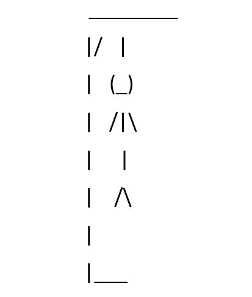

# Hangman

This program is an implemented game of hangman programmed in Python. It contains a test suite as well as a user interface. I made this project for my Principles of Computing Sciene I class at Ithaca College. 

## How to Play

This game randomly selects a word from a hard-coded list and displays the word as blank spaces. The user submits guesses by typing a letter and pressing the "Enter" key. If the letter entered is an entry other than a single, lowercase letter is entered, the user will be prompted again. If the letter is found in the word, the blank space(s) will be replaced with the corresponding letter. If the letter is not in the word, a message is displayed stating that a body part was drawn. If the user guesses all the letters in the word, a message is displayed stating "You win!". If the word is not complete before the body is completely drawn, a message is displayed stating the word as well as an image of the completed body. The program is then complete and finished running.

